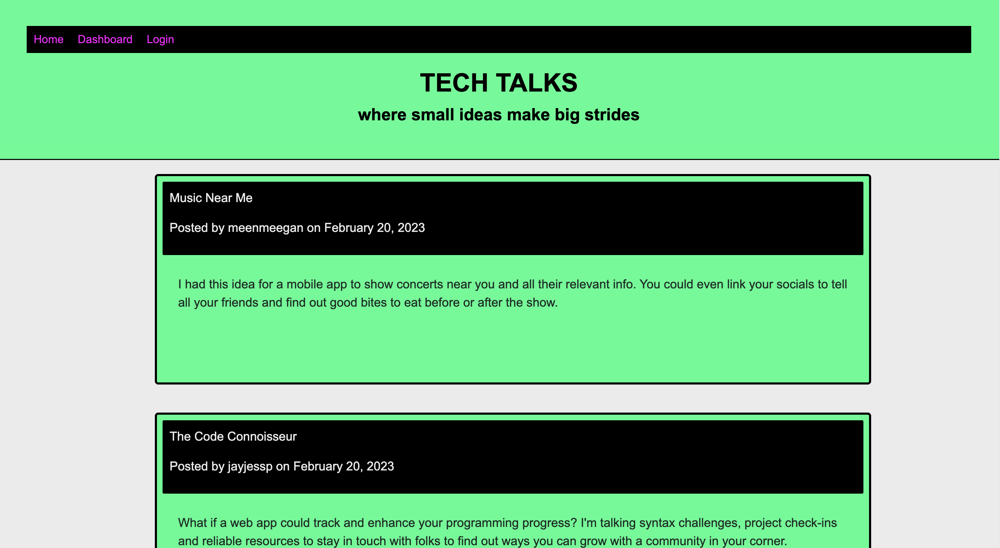

# Willy B's Tech Talks Blog

This was my first challenge using the MVC paradigm to structure my folder/file system.

While I ran into quite a few bugs as a result of mismatched file names, I wound up relying heavily upon the MVC paradigm to make sense of all the folders and files I created and sifted through to work out all the features of this blog site.

One of the bigger standout moments from this week's exploration was matching the names of the handlebar file names to match that of the page names following the forward slash ("/").

As specified in the Challenge Acceptance Criteria, the tech blog achieves the following:

✨ I am presented with the homepage, which includes existing blog posts if any have been posted; navigation links for the homepage and the dashboard; and the option to log in.

✨ I am taken to the homepage after clicking on the option.

✨ I am prompted to either sign up or log in after clicking on any other links.

✨ I am prompted to create a username and password upon signup.

✨ My user credentials are saved when I log into the site.

✨ I am prompted to enter my username and password when I revisit the site as a registered user.

✨ After login, I see navigation links for the homepage, the dashboard, and the option to log out.

✨ After clicking Home, I am taken to the homepage and presented with existing blog posts that include the post title and the date created.

✨ After clicking on a blog post, I am presented with the post title, contents, post creator’s username, and date created for that post and have the option to leave a comment.

✨ After making a comment, it's saved and the post is updated to display the comment, the comment creator’s username, and the date created.

✨ After clicking Dashboard, I am taken to the dashboard and presented with any blog posts I have already created and the option to add a new blog post

✨ After clicking to add a new post, I am prompted to enter both a title and contents for my blog post.

✨ After publishing a post, the title and contents of my post are saved and I am taken back to an updated dashboard with my new blog post.

✨ After clicking on an existing post, I am able to delete or update my post and taken back to an updated dashboard.

✨ I am logged out of the site when I log out.

✨ I am able to view comments but I am prompted to log in again before I can add, update, or delete comments after being idle on the site.

Below is a screenshot of my latest and greatest:

To visit Willy B's Tech Talks Blog, click [here](https://willybtechtalks.herokuapp.com/).
